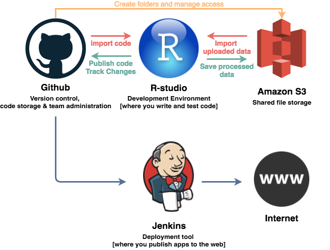

# Quick Start

## What is the platform?

The platform is a collection of of-the-shelf data science and web tools that work together in order to allow you to develop analysis scripts and web apps. 

- **R-studio:** An indegrated development enviroment for the R programming language. In practise, this is where you develop code, import data from Amazon S3, and save (refered to as a "commit") your code to Github. When using the platform, you'll spend the bulk of your time in R-studio. 
- **Github:** Primarily a place to store and track changes to code, but also used to create teams who have shared access to data and code.
- **Amazon S3:** Simple cloud file storage where you can upload secure data to folders (called "buckets").
- **Jenkins:** Automates the process of publishing your developed web content (stored in Github) to the web.  