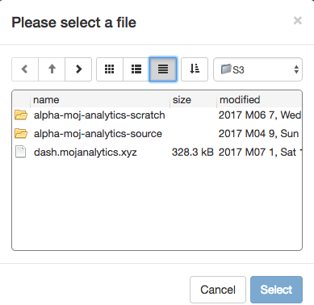
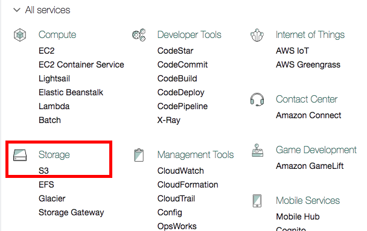
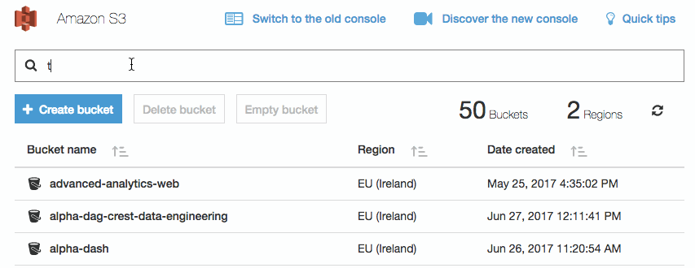
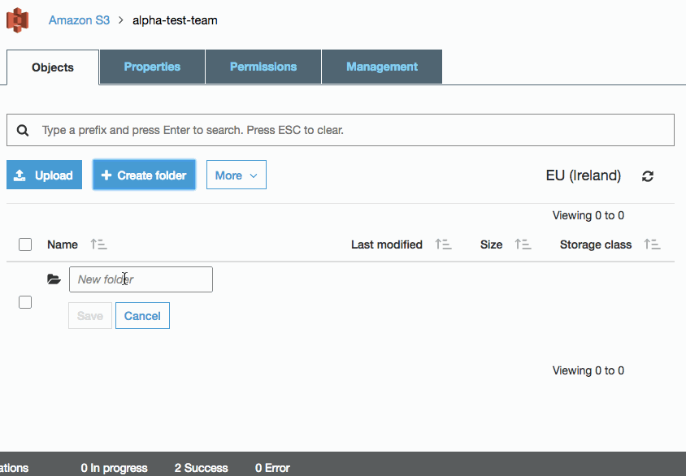
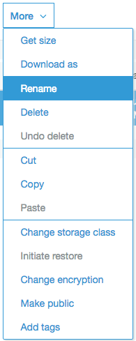

# Working with big datasets and sharing them: Accessing data in Amazon S3

[Amazon S3](https://en.wikipedia.org/wiki/Amazon_S3) is used as the
primary storage area for large data files. In contrast to files in your
personal home directory, files in S3 can be accessed by multiple
Platform users. You will only be able to access buckets that you have been granted access to (see [User Administration][User Administration]).

## Importing data from S3 into R

There are currently two methods of browsing and importing data held in S3 into RStudio.

### User Interface

We have developed a user interface that allows you to search and browse the files that you have been given access to. 



You can install the package as follows: 
```r
install.packages("devtools")
devtools::install_github("moj-analytical-services/s3browser")
```

See the [documentation](https://github.com/moj-analytical-services/s3browser) for
further details.


### Command line tool

We have also developed a command line tool that provides you with
some helper function. This enables you to do things like write
`read_s3_csv` to read directly from S3 into a data frame in R.

You can install this package as follows:
```r
install.packages("devtools")
devtools::install_github("moj-analytical-services/s3tools")
```
See the [documentation](https://github.com/moj-analytical-services/s3tools) for
further details.


## Uploading data to S3 

### Where data is stored 

An S3 bucket is automatically created for every team; for how to create and manage teams see [User Administration][User Administration]. By default, all members of the team have **read and write** access to the bucket. 


### Uploading data

In Amazon S3 storage areas are refered to as 'Buckets'. To access the buckets you need to visit the Amazon management console with the following link: https://alpha-analytics-moj.eu.auth0.com/samlp/NpfImg4P3ynU6HFx7ivYmqUZWQHfwi3Y (if you regularly upload data it may be worth bookmarking this link). 

Authentication is managed by GitHub, so if this is the first time you are connecting to the Amazon S3 Management console you may have to approve it. 

You'll be able to see all buckets, **including** those you **do not** have access to. 

To upload data, find the bucket you want to upload data to. Within the bucket you can create folders and upload files by following the on screen instructions. When uploading files **you will be prompted to set the settings for that file**. If this happens, the default settings are okay. 


#### Step-by-step instructions

1. Use the following [link](https://alpha-analytics-moj.eu.auth0.com/samlp/NpfImg4P3ynU6HFx7ivYmqUZWQHfwi3Y) to login 

2. Select the S3 service 
   

3. Select the bucket you wish to upload data to (the bucket will have the same name as the team, but spaces are replaced with `-` and all letters are lower case, so `Test Team` will have a bucket called `test-team`). While in **alpha** all buckets will also have the alpha prefix. 
   ​
The easiest way is to use the search: 
   

4. Use the interface to **create folders** or **upload files**. Note: The default settings are fine. 

   


#### Manipulating data

You can also move, rename and delete data using the S3 management console. Select the files by checking the text box, use the `More` button so see the options. 


