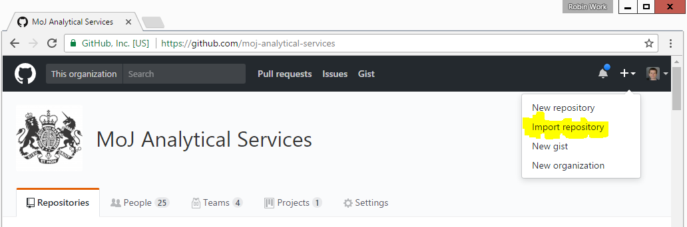
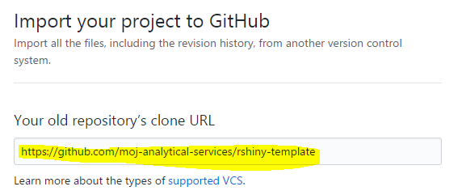
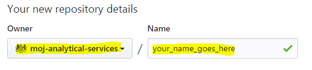
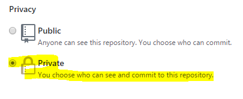
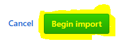
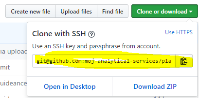
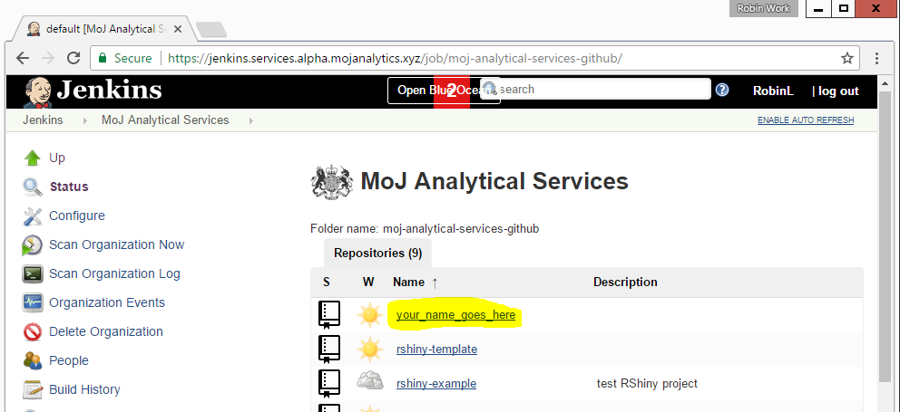
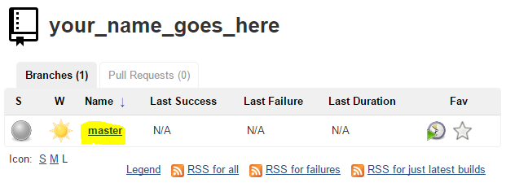
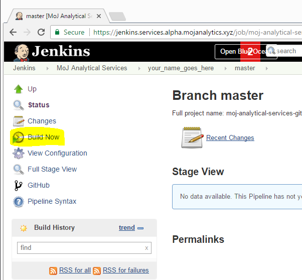
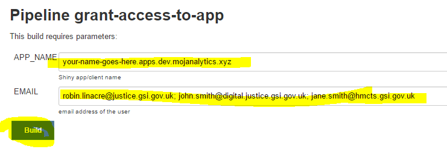

# Building a Shiny app that you can deploy on the Analytical Platform

The following steps to deploy a Shiny app are as follows:

1. Copy the [template project](https://github.com/moj-analytical-services/rshiny-example) within Github to a new repository, with a name of your choosing
2. In R Studio, start a new project from version control (file -> new project -> version control -> git).   TODO:  Remember to make sure the template has a Rproj that enables packrat
3. Work on your Shiny app, using the template `ui.R` and `server.R` files.  
4. Ensure that your package dependencies are snapshotted using `packrat::snapshot()`
4. When you're ready to share it, access the [Services control panel](https://jenkins.services.alpha.mojanalytics.xyz/), find your app, and click 'Build now'
5. Once deployed, grant users access to the app by inserting their names into the [Grant user access control panel](https://controlpanel.services.alpha.mojanalytics.xyz/).

Step-by-step instructions are below. 

For advanced users, the guidance [here][Advanced deployment] discusses customisability and options for deployment.  Refer to this guidance if you're already familiar with git, packrat etc.

## Step-by-step guide to deplying an app

### Copy the template project into a new Github repository

Begin by making a copy of the R Shiny template project.  



Enter `https://github.com/moj-analytical-services/rshiny-template` in the input box entitled 'Your old repository’s clone URL':



Ensure the 'owner' of the new repository is 'moj-analytical-services' and choose a name for your repository:



Make sure the repo is 'private' (this should be the default value):



and then click 'Begin import'




### In R Studio in the platform, create a new project from your new Github repository

In R Studio, navigate through the following menus:

File -> New project -> Version control -> Git)

TODO:  Add screenshot of dialogue

In 'Repository URL', enter the URL of the repository you just created.  This needs to be the SSH URL (starting with `git@github`), **NOT** the HTTPS url (which starts with `https`).  It is therefore in the following format:

```
git@github.com:moj-analytical-services/your_name_goes_here.git
```

R Studio will create a new project folder for you with all the template files in.  

You can now start building your Shiny app by editing `server.R` and `ui.R` files.

#### Further notes for if you're having trouble finding your new repo's url

If you navigate to your new repository's home page (which will have a url in the form `https://github.com/moj-analytical-services/your_name_goes_here`), you can use the following buttons to access this url (make sure you click the 'ssh' button):





### Work on your app

You can now work on your Shiny app in R Studio as normal.  As you work, commit your changes to Github using your chosen Github workflow.

### Snapshot dependencies using packrat

Your Shiny app will have dependencies on various third-party R packages (e.g. `dplyr`).  These packages change through time, and sometimes these changes are not backwards compatible.  When we deploy you Shiny app, it is therefore essential to include a manifest of all of the package dependencies and their specific versions. 

The R package`packrat` automates this process.  Before deploying your app, you need to call `packrat::snapshot()` to automatically create this manifest.  You will then probably want to call `packrat::clean()` to remove any dependencies which are no longer in use.

This creates a file called `packrat/packrat.lock`.  You need to ensure you have committed this to the Github repository prior to deployment

### Scan organisation and deploy

The platform automatically scans git repositories in the [moj-analytical-services](https://github.com/moj-analytical-services/) Github organisation to find repos which are ready to deploy.  It does this by checking whether repositories contains two 'magic' files which control deployment:  `Jenkinsfile` and `Dockerfile`.

To deploy your app, go [here](https://jenkins.services.alpha.mojanalytics.xyz/job/moj-analytical-services-github/).  

You will see a list of apps which have been detected.  Find yours and click on the link:



Then click on the branch you wish to deploy (this will usually be 'master'):



Finally, click 'Build':



### Grant secure access to the app

Users are granted access to the app using a list of email addresses separated with a space, comma, or semicolon.

To grant access, complete the form [here](https://controlpanel.services.alpha.mojanalytics.xyz/job/grant-access-to-app/build?delay=0sec), and press 'Build'.

For example, your form might look like this:



NOTE:  Any characters which are not alphanumeric or dashes are converted into dashes.  


## Advanced deployment

This section contains guidance for advanced users on app deployment.

### What is run when I deploy a Shiny app?

When you deploy an app, the R Shiny server runs `shiny::runApp()` within the project.  This is equivalent to what it does when you press 'run' in a R Shiny project within R Studio.

To understand how you can use this to deploy apps of different types, we can refer to the `runApp` [docs](https://shiny.rstudio.com/reference/shiny/latest/runApp.html).  Specifically, the 'arguments' section is useful:

```
Arguments
	appDir	The application to run. Should be one of the following:
		A directory containing server.R, plus, either ui.R or a www directory that contains the file index.html.
		A directory containing app.R.
		An .R file containing a Shiny application, ending with an expression that produces a Shiny app object.
		A list with ui and server components.
		A Shiny app object created by shinyApp.
```

One of those options is `A directory containing app.R.`, which should contain: `An .R file containing a Shiny application, ending with an expression that produces a Shiny app object.`.

This gives the developer a wider range of options of how to deploy a Shiny app, and makes it possible to deploy shiny apps which are bundled into pre-existing packages e.g. see [here](https://github.com/RobinL/costmodelr/blob/b328902026bd1cce5d17b487e310c59725ea4d62/R/shiny_explorer.r#L20).
 
### Can I change my build?
 
Yes - if you know Docker, you are welcome to change the
[Dockerfile](https://github.com/moj-analytical-services/rshiny-template/blob/master/Dockerfile).