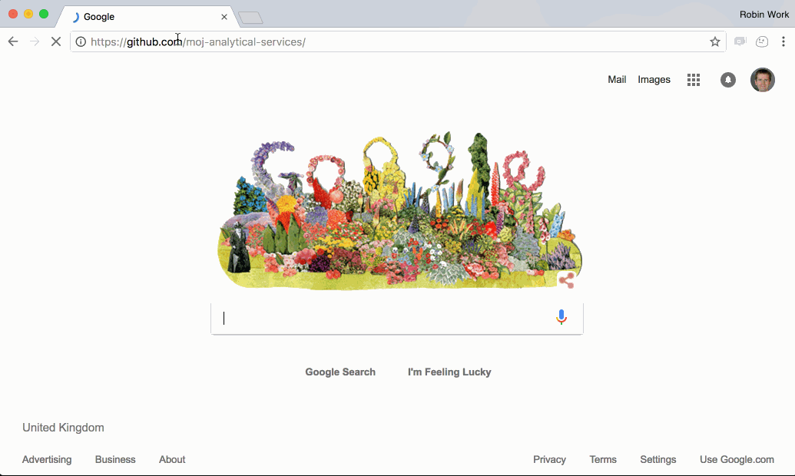

# Using Github with R Studio

Github enables you to collaborate with colleagues on code and share you work with them. It puts your code in a centralised, searchable place. It enables easier and more robust approaches to quality assurance, and it enables you to version control your work.

This guide provides a step-by-step guide of how to create a project and sync your work with Github.  You can find more in-depth Git training resources [here](https://moj-analytical-services.github.io/platform_user_guidance/getting-started.html#training-resources)

Note:  If any of the animated gifs below do not display correctly, try a different web browser e.g. Microsoft Edge, which is installed on your DOM1 machine.

## Syncing you R Studio work with Github

### Step 1 - Create a new project ('repo') in the moj-analytical-services Github page

This is conceptually similar to setting up a folder on the DOM1 shared drive to save your work, and share it with others. The files in this Github repo represent the definitive version of the project. Everyone who works on the project makes contributions to this definitive version from their personal versions.

Note that if you want to contribute to an existing project, you can skip this step.

To begin, navigate to www.github.com and make sure you're logged in.  

Once logged in, go to the MoJ Analytical Services homepage at https://github.com/moj-analytical-services/

Then follow the steps in this gif to create a new repository.

  
  
  
Notes:

* Make sure that the repository is set to 'private'.  This is the default setting.  If you change this setting to 'public', your code will be available on the open internet.

* Make sure the owner is set to 'moj-analytical-services'.  This is the default setting, so long as you have clicked on 'New' from the https://github.com/moj-analytical-services homepage.
  
### Step 2:  Navigate to your platform R Studio and make a copy of the Github project in your R Studio

In this step, we create a copy of the definitive github.com project in your personal R Studio workspace.  This means you have a version of the project which you can work on and change.

Follow the steps in this gif:

  
  
Notes:

* When you copy the link to the repo from Github, ensure you use the ssh link, which start `git@github.com` as opposed to the https one, which start `https://github.com/`
  
### Step 3: Edit your files, track them using Git, and sync ('push') changes to Github

Edit your files as usual using R Studio.  

Once you're happy with your changes, Git enables you to create a 'commit'. Each git commit creates a snapshot of your personal files on the Platform. You can can always undo changes to your work by reverting back to any of the snapshots.  This 'snapshotting' ability is why git is a 'verson control' system.  

In the following gif, we demonstrate changing a single file, staging the changes, and committing them.  In reality, each commit would typically include changes to a number of different files, rather than the single file shown in the gif.

Notes:

* 'commiting' does **not** sync your changes with github.com.  It just creates a snapshot of your personal files in your R Studio environment.
* Git will only become aware of changes you've made after you've saved the file as shown in the gif.  Unsaved changes are signified when the filename in the code editior tab is red with an asterix.

 
 
 
 ### Step 4: Sync ('push') your work with github.com
 
 In R Studio, click the 'Push' button (the green up arrow).  This will send any change you have committed to the definitive version of the project on Github. You can then navigate to the project on Github in your web browser and you should see the changes.
 
 Notes:
 
 * After pushing, make sure you refresh the GitHub page in your web browser to see changes.

 
 
 
 
 
 
 
**That's it!  If you're working on a personal project, and are not collaborating with others, those three basic steps will allow you to apply version control to your work with Github**

### Using the shell
If you are more comfortable using the shell (terminal) you can do steps 3 and 4 using the following git commands:
* Select the files you want to commit (known as staging): `git add <filename1> <filename2>`
* Commit the files you have staged: `git commit`. After calling this command a popup will ask you to write in a commit message. After doing so press enter.
* Finally push your changes to GitHub: `git push origin <branch_name>`. Most likely your branch name will be `master` which is the default. So your code would be `git push origin master`.

## Working on a branch.

One of the most useful aspects of git is 'branching'.  This involves a few extra steps, but it enables some really important benefits:

* Allows you to separate out work in progress from completed work.  This means there is always a single 'latest' definitive working version of the code, that everyone agrees is the 'master copy'.

* Enables you and collaborators to work on the same project and files concurrently, resolving conflicts if you edit the same parts of the same files.

* Enables you to coordinate work on several new features or bugs at once, keeping track of how the code has changed and why, and whether it's been quality assured.

* Creates intutitive, tagged 'undo points' which allow you to revert back to previous version of the project e.g. we may wish to revert to the exact code that was tagged 'model run 2015Q1'.

We therefore *highly recommend* using branches.  (Up until now, we've been working on a single branch called 'master'.)

### Step 1 (optional):  Create an Issue in github that describes the piece of work you're about to do (the purpose of the branch)

Github 'issues' are a central place to maintain a 'to do' list for a project, and to discuss them with your team.  'Issues' can be bug fixes (such as 'fix divide by zero errors in output tables'), or features (e.g. 'add a percentage change column to output table'), or anything else you want.

By using issues, you can keep track of who is working on what.  If you use issues, you automatically preserve a record of _why_ changes were made to code.  So you can see when a line of code was last changed, and which issue it related to, and who wrote it.

### Step 2:  Create a new branch in R Studio and tell Github about its existence

Create a branch with a name of your choosing.  The branch is essentially a label for the segment of work you're doing.  If you're working on an issue, it often makes sense to name the branch after the issue.

To create a branch, you need to enter the following two commands into the shell:

* `checkout -b my_branch_name`.  Substitute `my_branch_name` for a name of your choosing. This command simultaneously creates the branch and switches to it, so you are immediately working on it.  
* `git push -u origin my_branch_name`.  This tells github.com about the existence of the new branch.  

### Step 3:  Make some changes to address the Github issue, and push (sync) them with Github

Make changes to the code, commit them, and push them to Github.  

### Step 4: View changes on Github and create pull request

You can now view the changes in Github.  

Github recognises that you've synced some code on a branch, and asks you whether you want to merge these changes onto the main 'master' branch.

You merge the changes using something called a 'pull request'.  A 'pull request' is a set of suggested changes to your project.  You can merge these changes in yourself, or you can ask another collaborator to review the changes.

One way of using this process is for quality assurance. For instance, a team may agree that each pull request must be reviewed by a second team member before it is merged.  The code on the main 'master' branch is then considered to be quality assured at all times. Pull requests also allow you and others working on the project to leave comments and feedback about the code. You can also leave comments that reference issues on the issue log (by writing `#` followed by the issue number). For example you might comment saying "This pull request now fixes issue #102 and completes task #103".

### Step 5:  Sync the changes you made on github.com with your local platform

When you merged the pull request, you made changes to your files on Github.  Your personal version of the project in your R Studio hasn't changed, and is unaware of these changes.

The final step is therefore to switch back to the 'master' branch in R Studio, and 'Pull' the code.  'Pulling' makes R Studio check for changes on Github, and update your local files to incorporate any changes.

## Git training Resources

If you are new to git and you want to learn more, we recommend that you complete the basic tutorial [available here](https://try.github.io/levels/1/challenges/1).

The slides from from the ASD git training are [available here (dom1 access only)](file://dom1.infra.int/data/hq/102PF/Shared/Group_LCDSHD2/Analytical Services/ASD Training/Training materials/git/git_training_slides.pdf)

- [Using Github with R](http://happygitwithr.com/)
- [Introductory interactive tutorial](https://try.github.io/levels/1/challenges/1).
- Quickstart guide and cheatsheet [here](http://rogerdudler.github.io/git-guide/) and in pdf format  [here](http://rogerdudler.github.io/git-guide/files/git_cheat_sheet.pdf).
- More in depth materials:
    - [Learn Git branching](http://learngitbranching.js.org/)
    - [Git from the inside out](https://maryrosecook.com/blog/post/git-from-the-inside-out)

## Other tips and tricks [Work in progress!]:

### Search the code in MoJ Analytical Services to see who else has used a package.

### Hyperlink to a specific line of code in your project

### Make your project available to people on different teams

### Assign a reviewer to a pull request, and leave comments.

### View how files have changed on the platform and on 

 
 
 
 
