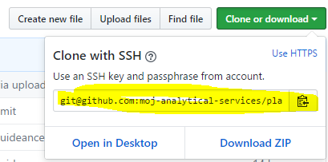

# Deploying a Static Web App  

The following steps to deploy a Shiny app are as follows:

1. Copy the [template project](https://github.com/moj-analytical-services/webapp-template) within Github to a new repository, with a name of your choice.
2. In R Studio, start a new project from version control (file -> new project -> version control -> git).   TODO:  Remember to make sure the template has a Rproj that enables packrat
3. Work on your static website - the exposed content will be in the `www/` directory and `www/index.html` will be the landing page.   
4. When you're ready to share it, access the [services control panel](https://jenkins.services.alpha.mojanalytics.xyz/), find your app, and click 'Build now'. This will prepare your site for deployment.
5. Once the first deployment has completed, revisit the  [services control panel](https://jenkins.services.alpha.mojanalytics.xyz/) and deploy again. This time you will be prompted to select permission levels for the site (i.e. whether it should be available for DOM1, Quantum, or external).

## Step-by-step guide to depolying an static web app

### Copy the template project into a new Github repository

1. Begin by making a **copy** of the R Shiny template project on Github: https://github.com/new/import

2. Enter `https://github.com/moj-analytical-services/webapp-template` in the input box entitled 'your old repository’s clone URL:'

3. Ensure the 'owner' of the new repository is 'moj-analytical-services' and choose a name for your repository:

4. Make sure the repo is 'private' (this should be the default value):

5. Click 'Begin import'

   

### In your chosen development enviroment, clone the git repository

You can find the clone link on the Github repository.

To download a copy to start editing on your local machine, you need to 'clone' the repositry. If you're using a shell: `git clone git@github.com:moj-analytical-services/YOUR-REPO-NAME.git`

#### Further notes if you're having trouble finding your new repo's url

If you navigate to your new repository's home page (which will have a url in the form `https://github.com/moj-analytical-services/your_name_goes_here`), you can use the following buttons to access this url (make sure you click the 'ssh' button):

### Work on your web app

Work on your web app using your chosen development enviroment. As you work, commit your changes to Github using your chosen Github workflow.

### Scan organisation and deploy

The platform automatically scans git repositories in the [moj-analytical-services](https://github.com/moj-analytical-services/) Github organisation to find repos that are ready to deploy.  It does this by checking whether repositories contains two 'magic' files that control deployment:  `Jenkinsfile` and `Dockerfile`.

To deploy your app, go [here](https://jenkins.services.alpha.mojanalytics.xyz/job/moj-analytical-services-github/).  

1. You will see a list of apps that have been detected.  Find yours and click on the link with its name (if you're app isnt listed then click "Scan Organisation Now" on the left hand menu and wait for the scan to complete. This step may take a few minutes.)

2. Then click on the branch you wish to deploy (this will usually be 'master')

3. Click 'Build'.

   1. If this is the first time you've deployed the webpage will be setup, but you'll need to build again to grant by running the build a second time.

   2. You will need to decide whether email authentication is enabled (where you grant users access on an email or if access is restricted based on network). For a ellaboration on this see [Access levels][Access levels].

      In the example below, I grant unrestricted access to the app.  

## Accessing the app

Depending on the settings you selected, the website will either be available directly or authenticated via email. The URL for the app will be the `respository-name` followed by `apps.alpha.mojanalytics.xyz`.

So for the example project above "static-web-deploy", the deployment URL will be `https://static-web-deploy.apps.alpha.mojanalytics.xyz`.

Note that characters that are not compatible with website URLs are converted. So, repositories with underscores in their name (e.g. `repository_name.apps...`) will be converted to dashes for the URL (e.g. `repository_name.apps...`). 

## Access Levels

When deploying a static website you'll be asked for **IP restrictions** and whether **authentication** is required.

**IP restrictions** restrict access the the static website based on the users network address. This can be useful if you want to make a site accessable to the organisation, without having to grant access on an email-by-email basis.

The available levels are:

- DOM1 (excluding guest WiFi users but including those using AnyConnect)
- DOM1 and Quantum
- DOM1, Quantum and 102PF WiFi (including guest WiFi users)
- DOM1, Quantum, 102PF WiFi and Clive House WiFi (including guest WiFi users)
- Any location (this is a public website)

The **authentication** tickbox determines whether or not users will have to be granted access via their email address. If you wish to enable this option visit the [grant user access control panel](https://controlpanel.services.alpha.mojanalytics.xyz/), where you can enter a list of emails. For more info see the [secure access documentation][Grant secure access to the app].

## Advanced deployment

This section contains guidance for advanced users on app deployment.

### Can I change my build?

Yes - if you know Docker, you are welcome to change the
[Dockerfile](https://github.com/moj-analytical-services/webapp-template/blob/master/Dockerfile).
