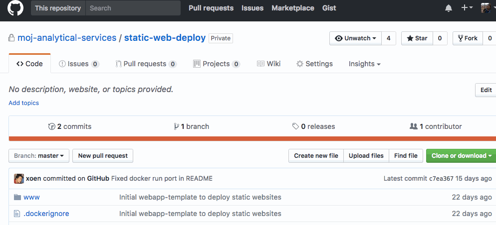
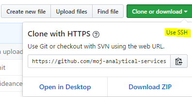

# Deploying a Static Web App

There are two ways to deploy a static web app.

## Choice of Static Web App Deployment

### Option 1

Uses [this template](https://github.com/moj-analytical-services/webapp-template) to deploy the full static web app from GitHub. You might want to do this when it is imperitive to version the full app. It would also make it easier for you and collaborators to understand how the app works make edits and vett changes.

### Option 2

Uses [this template](https://github.com/moj-analytical-services/s3-proxy-webapp-template) to deploy a static web app that is dependent on the data it points to in S3. Use this one if you are less worried about versioning and want to automatically update your app frontend based on whatever data is the the apps bucket (e.g. if you have an airflow job that auto generates the HTML for this app).

After you have chosen a template to use, Step-by-step instructions are below on how to deploy your app.

## Step-by-step guide to depolying an static web app

### Use the webapp template

To create a new repository based on the webapp template:

1. Go one of the webapp templates [option 1](https://github.com/moj-analytical-services/webapp-template) or [option 2](https://github.com/moj-analytical-services/s3-proxy-webapp-template) repository.
2. Select __Use this template__.
3. Fill in the form:
    + Owner: `moj-analytical-services`
    + Name: The name of your app, for example, `my-app`
    + Privacy: Private
4. Select __Create repository from template__.

This copies the entire contents of the app template to a new repository.

### In your chosen development enviroment, clone the git repository

You can find the clone link on the Github repository.

To download a copy to start editing on your local machine, you need to 'clone' the repositry. If you're using a shell: `git clone git@github.com:moj-analytical-services/YOUR-REPO-NAME.git`

#### Further notes if you're having trouble finding your new repo's url

If you navigate to your new repository's home page (which will have a url in the form `https://github.com/moj-analytical-services/your_name_goes_here`), you can use the following buttons to access this url (make sure you click the 'ssh' button):

### Work on your web app

Work on your web app using your chosen development enviroment. As you work, commit your changes to Github using your chosen Github workflow.

#### Option 1

Add the webapp structure, htmls, javascript, etc to your repository making sure that the files to serve are in the `www/` directory as these will be served by the web server (NGINX).

#### Option 2

In your Dockerfile set the line `ENV AWS_S3_BUCKET=alpha-app-your-app-bucket` to your apps bucket name. Once your webapp is deployed you can setup your app to read data from the bucket you spefied. The app will look for and host a `index.html` that should be in the root directory of your app's S3 bucket.

### Scan organisation and deploy

Include a `deploy.json` file so that Concourse will automatically build and deploy your app, so that it is running and customers can access it. For more about this see: [Build and deploy guidance](https://moj-analytical-services.github.io/platform_user_guidance/build-and-deploy.html)

### Grant secure access to the app

To grant access to someone, in the [Control Panel's Wepapps tag](https://cpanel-master.services.dev.mojanalytics.xyz/#Webapps) find your App and click "Manage App". In the 'App customers' section you can let people view your app by putting one or more email addresses in the text box and clicking "Add customer".

You can also let anyone access it by setting `"disable_authentication": true` in the `deploy.json` and redeploying it - see above.

**Note** that users can only access the app from a computer on a specified corporate network. These are defined in the `deploy.json` under the parameter `allowed_ip_ranges` - see below.

#### deploy.json

| parameter | notes |
| --------- | ------- |
| `allowed_ip_ranges` | e.g. `["DOM1", "QUANTUM", "102PF Wifi"]` or `["Any"]`|
| `disable_authentication` | To let anyone access the app, set this to `true`, otherwise `false` restricts it to people authorized for the app in the Control Panel |

If you deployed with authentication enabled users are granted access to the app using a list of email addresses separated with a space, comma or semicolon.

Changes to deploy.json only take effect when committed to GitHub, a Release is created and the deploy is successful (see [Scan organisation and deploy][Scan organisation and deploy])

## Accessing the app

Depending on the `disable_authentication` setting, the website will either be available directly or authenticated via email. The URL for the app will be the `respository-name` followed by `apps.alpha.mojanalytics.xyz`.

So for the example project above "static-web-deploy", the deployment URL will be `https://static-web-deploy.apps.alpha.mojanalytics.xyz`.

Note that characters that are not compatible with website URLs are converted. So, repositories with underscores in their name (e.g. `repository_name.apps...`) will be converted to dashes for the URL (e.g. `repository_name.apps...`).

## Advanced deployment

This section contains guidance for advanced users on app deployment.

### Can I change my build?

Yes - if you know Docker, you are welcome to change the
[Dockerfile](https://github.com/moj-analytical-services/webapp-template/blob/master/Dockerfile).
