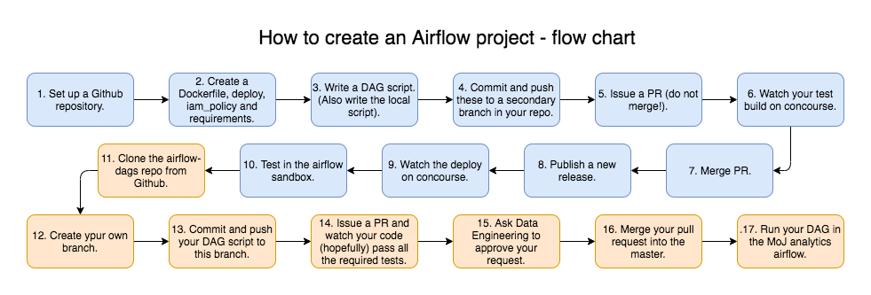
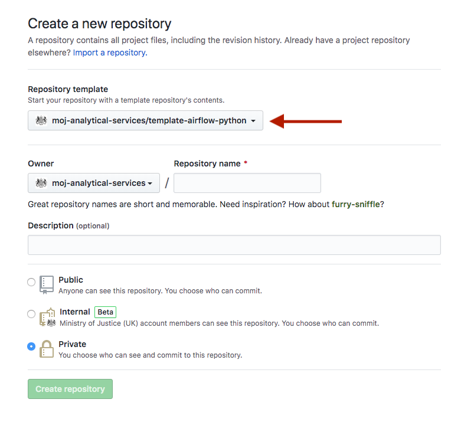
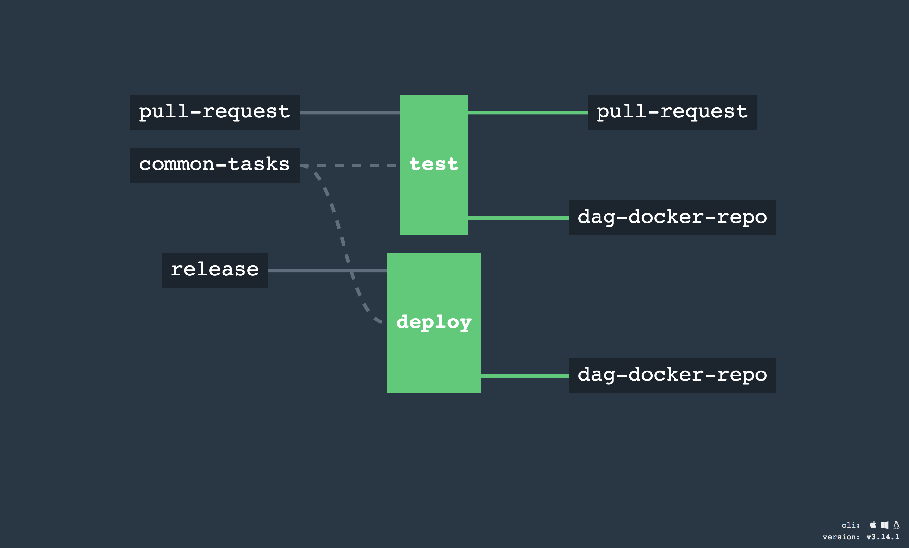
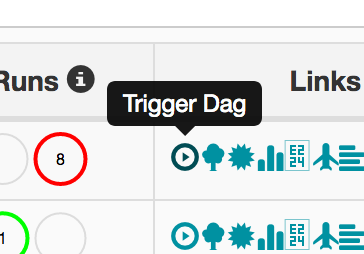
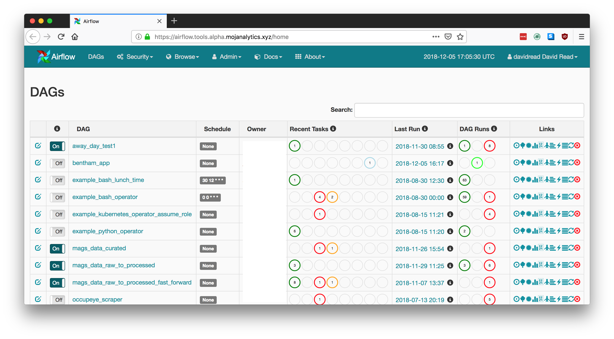

# Data pipelines

## Summary

You can deploy your data processing code to the cloud. Airflow is a tool on the Analytical Platform that is a managed place for your "data pipeline" to run. This can be useful, for example, to:

* run a long job overnight
* run it on a regular schedule (e.g. every night)
* when multiple outputs require the same intermediate result, it can be calculated once for them all
* people other than yourself can see the run and its output (compared to if you run it in your R Studio or Jupyter)
* you keep a history of all the pipeline runs, showing what you ran, the logs, what tasks failed and how long it took

## Concepts

* A **data pipeline** is referred to in Airflow as a Directed Acyclic Graph ("DAG"). It is made up of "tasks" which are arranged into a DAG.
* A **DAG** could be simple: Task 1 >> Task 2 >> Task 3 (meaning run Task 1 then Task 2 then Task 3). Or a task can be dependent on multiple previous tasks, and when its complete it can trigger multiple tasks. The "Acyclic" part means you can't have loops.
* Each **DAG** is a GitHub repository, containing code files that will be run (e.g. R or python) plus parts that define the environment it runs in - a Dockerfile and an AWS IAM policy.
* You define the DAG to run on a regular schedule, and/or run it by clicking the "Play" button on the Airflow web interface

## Set up a pipeline (how to start Airflow)
The steps to setting up an airflow pipeline are as follows

1. Set up a Github repository.
2. Create a Dockerfile, deploy.json, iam_policy.json and requirements/environment.
3. Write a DAG script. (Also write the local script).
4. Commit and push these to a secondary branch in your repo.
5. Issue a PR (do not merge!).
6. Watch your test build on concourse.
7. Merge PR.
8. Publish a new release.
9. Watch the deploy on concourse.
10. Test in the airflow sandbox.
11. Clone the airflow-dags repo from Github.
12. Create ypur own branch.
13. Commit and push your DAG script to this branch. 
14. Issue a PR and watch your code (hopefully) pass all the required tests.
15. Ask Data Engineering to approve your request.
16. Merge your pull request into the master.
17. Run your DAG in the MoJ analytics airflow.

### 1. Set up the Github repository.

Each DAG should be a git repository:

* It should be under the https://github.com/moj-analytical-services organization
* The name of the repo is recommended to start with `airflow-`

You can create a new repo from the [template](https://github.com/moj-analytical-services/template-airflow-python).

### 2. Create a Dockerfile, deploy.json, iam_policy.json and requirements/environment.
The repo should include:

a. The `Dockerfile` - contains commands to set-up a Docker image that does your data processing. This is what concourse will build to create your data pipeline.

    Here's an example python one:
    Some sections are written for Python and R, choose which to keep.

        # Begin with a standard base image (from https://hub.docker.com/_/python/ )
        FROM python:3.7

        # R
        FROM quay.io/mojanalytics/docker-conda-base:v1.0.0
        
        # Update the system libraries
        # (The python base image is based on debian)
        RUN apt-get update
        # Install new system libraries
        RUN apt-get install -y --no-install-recommends \
            python-numpy

        # Set the default place in the image where files will be copied
        WORKDIR /usr/src/app

        # Copy files from the repo into the image. Note this will be different if you use R code and dependencies.
        # Python
        COPY requirements.txt ./
        COPY . .
        
        # R
        ADD environment.yml environment.yml

        # Install python/R dependencies.
        # Python
        RUN pip install --no-cache-dir -r requirements.txt

        # R
        RUN conda env update --file environment.yml -n base

        # Run the data processing
        # This is the equivalent of typing: python ./my_script.py
        ENTRYPOINT python -u my_script.py
    Tip: You can put several related scripts in one repo, and choose which one gets run using an environment variable e.g. https://github.com/moj-analytical-services/airflow-magistrates-data-engineering/blob/88986cf7dbcca9b7ebc21bc2d1286464615739d7/Dockerfile#L19

    Tip: Some python packages, such as 'numpy' or 'lxml', come with C extensions which can cause bother. If installed via pip (requirements.txt) those C extensions are compiled, which can be slow and liable to failure. The Dockerfile example above shows how to avoid these problems with numpy (which is needed by pandas) - it is installed instead using a debian package: `python-numpy`.

b. `deploy.json` - This is for Concourse to build the repo into a Docker image

    For example:

        {
            "mojanalytics-deploy": "v1.0.0",
            "type": "airflow_dag",
            "role_name" : "airflow_enforcement_data_processing"
        }

    The version number does nothing. The `role_name` needs to be:

    * unique to the Analytical Platform
    * prefixed `airflow_`, otherwise you'll get a build error like this: `An error occurred (AccessDenied) when calling the GetRole operation: User: arn:aws:iam::593291632749:user/dev-concourse-role-putter is not authorized to perform: iam:GetRole on resource: role airflow-prison-population-hub`

c. `iam_policy.json` - This tells Concourse to create an AWS role that gives your code permission to access AWS resource, such as data in S3 buckets. 
    
The iam_policy.json can be built from an iam_policy using the iam_builder package. See: https://github.com/moj-analytical-services/iam_builder for guidance.

e.g. See: https://github.com/moj-analytical-services/airflow-enforcement-data-engineering/blob/master/iam_policy.json for an example.
    
  
d. `requirements.txt` or `environment.yml`
If you are using python you will need a `requirements.txt` file. If youare using R you will need an `environment.yml`, yaml file.
  
    `requirements.txt`
    This is a file containing the names of the modules used in your script you intend to run using airflow (the first one you wrote before getting into airflow).
        An example `requirements.txt` is given below.
        
            # Example requirements.txt
            datefinder==0.7.0
            requests==2.20.1
            pandas==0.23.4
            beautifulsoup4==4.6.3
            apache-airflow==1.10.5
            kubernetes==10.0.1
      
    **You can find the list of locally installed packages and their version numbers by typing `pip freeze` into your terminal.**
      
    `environment.yml`
    [###INSERT HOW TO CREATE AN ENVIRONMENT HERE###]
    

### 3. Write a DAG script. (Also write the local script.)
Next write your DAG script. This will define what tasks Airflow will run, the order in which they are run and the variables to run them with (e.g. schedule).

Example DAG script:
    
    # airflow-example-repo.
    from datetime import datetime
    from airflow.contrib.operators.kubernetes_pod_operator import KubernetesPodOperator
    from airflow.utils.log.logging_mixin import LoggingMixin
    from airflow.models import DAG

    log = LoggingMixin().log
    
    # The image build version that Airflow will run.
    IMAGE_VERSION = "v1.0.0"
    # The repo must be your repo on Github.
    REPO = "airflow-example-repo"

    IMAGE = (
        f"593291632749.dkr.ecr.eu-west-1.amazonaws.com/"
        f"{REPO}:{IMAGE_VERSION}"
    )
    
    # The role and namespace are different in the local DAG script.
    ROLE = "airflow_example_dag_script"
    NAMESPACE = "airflow"

    task_args = {
        "depends_on_past": False,
        "email_on_failure": True,
        "owner": "##YOUR_GH_USERNSME##",
        "email": ["example@justice.gov.uk"],
    }
    
    dag = DAG(
        dag_id="example_dag",
        default_args=task_args,
        description=(
            "A description of what your DAG does."
        ),
        start_date=datetime(2019, 9, 30),
        schedule_interval=None,
    )
    
    my_pod_task = KubernetesPodOperator(
        dag=dag,
        namespace=NAMESPACE,
        image=IMAGE,
        env_vars={
            "AWS_METADATA_SERVICE_TIMEOUT": "60",
            "AWS_METADATA_SERVICE_NUM_ATTEMPTS": "5",
            "AWS_DEFAULT_REGION": "eu-west-1",
        },
        name="crimeoutcomesstats",
        labels={"app": dag.dag_id},
        in_cluster=True,
        task_id="example_kubernetes_pod",
        get_logs=True,
        annotations={"iam.amazonaws.com/role": ROLE},
    )

Things to note about this script:

* The image version must be the same as that as your planned release number. For example if you had previously released `v0.0.9` you must commit this version with `v1.0.0` before the build and release process otherwise Airflow won't run your most recent image.
* The pod can be triggered by other factors if there are other pods in the script using `trigger_rules`. See http://airflow.apache.org/concepts.html for examples.
* Different callbacks can be triggered on success or failure. The standard failure callback will send the email address, defined above, an email containing links to the logs of the failure, but custom emails can be sent. See https://github.com/moj-analytical-services/airflow-serious-violence-briefings/blob/master/serious_violence_briefings_airflow.py for an example.
* if you want to run several pods in one script you must define there order as one final line in the DAG. For example, `task_1 >> task_2 >> task_3`.
* There must also be one blank line at the bottom following this (a quirk of the system or it will raise a pep8 error - as you will learn later).
* Their must also be a local version of this DAG script in your `airflow/dags` folder. This requires a different `ROLE` and `NAMESPACE` as shown below. The rest can remain the same.

Changes to `ROLE` and `NAMESPACE` for local DAG script:
This must be saved in your `airflow/dags` folder.
    
    # airflow sandbox script.
    # keep the rest of the script the same.
    ROLE = "alpha_user_###YOUR GH USERNAME###"
    NAMESPACE = "user-###YOUR GH USERNAME###"
    
    
#### 3a. Test your image - locally on a Macbook

If you have a Macbook you can use it to test that your Docker image will build, which is much quicker to debug than waiting for Concourse every time you make a change. This can be useful for checking your Dockerfile syntax is right and the dependencies install ok.

However when you run the Docker image, it won't be able to access your project data (from S3), because your machine doesn't have your AP account's AWS credentials. This is right because you shouldn't have sensitive data on your Macbook in general. So the Docker image will fail when it tries to access AWS data, but you've still usefully checked the build works and the install of dependencies.

You need to have installed [Docker for Mac](https://docs.docker.com/docker-for-mac/install/). When it is running you can see its whale icon in the task bar. It consumes 2GB RAM, so you may well not want it to run everytime your machine starts up - change this under "Preferences..." then uncheck "Start Docker when you log in".

To test your Docker image:

i. Clone your repo to your Macbook. e.g. in a terminal:

        git clone git@github.com:moj-analytical-services/airflow-occupeye-scraper.git

   This authenticates GitHub using SSH, so if this is the first time on your machine, you'll need to [create an SSH key and add it to your GitHub account](https://help.github.com/articles/connecting-to-github-with-ssh/) first.

ii. Build the repository (from the directory with the Dockefile in it):

        cd airflow-occupeye-scraper
        docker build . -t my-pipeline:0.1

   (If you get `Cannot connect to the Docker daemon at unix:///var/run/docker.sock. Is the docker daemon running?` you need to start 'Docker' application from your Mac's Launchpad)

   This goes through each line ("step") of the Dockerfile and builds (or executes) each in turn (apart from the final `CMD`). The first build can take a while, but the result of each step is saved to disk, so if you change a step and do another build, it only needs to restart from the step that is changed.

iii. You might want to run the image as a container, which runs your data processing code specified in the `CMD` of the Dockerfile:

        docker run my-pipeline:0.1

   Which should hopefully get as far as talking to AWS before failing.

iv. You can 'shell into' the linux container to take a look for debug purposes:

        docker run -it my-pipeline:0.1 bash

   And if `bash` is not available, try `sh`.

### 4. Commit and push to Github.
Now commit all the above files to a secondary branch (which you will probably need to create) on Github. Ensuring the version number has been increased.

See the Github guidance for creating and pushing to branches: https://docs.google.com/presentation/d/1dRhbprKugJUrN39AKdmSitSaw7dnRaAZROJlymXSQ-U/edit

Tip:

* Before you commit, run the file with python to check the python syntax is ok. If it gets as far as giving you import errors then you know the python syntax is ok. (If you can be bothered to install the python libraries you could run it all)

### 5. Issue a pull request (do not merge!).
Create a pull request from your secondary branch to the master branch. Do **NOT** merge it yet.

### 6. Watch your test build on concourse.
Log onto concourse (https://concourse.services.alpha.mojanalytics.xyz/). Select your repo and watch it build. Sometimes if you commit before the pull request is open you will need to manually trigger the build, which is done by clicking the `test` box then pressing grey 'plus' sign in the top right hand corner. 

You can check which commit and pull request the test is building from if you look at the right hand side of the page as the test builds (as a quick QA of the process so far).

The top bar will be grey while the pend builds, yellow while it is building, green if the build is successful or red if it fails. [#How do I change colors in Rmd?#]

Concourse will:

* build your GitHub repository into a Docker image
* upload the Docker image to a private location in AWS Elastic Container Registry
* creates the AWS Role

For more about the build see: [Build and deploy guidance](https://moj-analytical-services.github.io/platform_user_guidance/build-and-deploy.html)

### 7. Merge your PR.
Once your test builds successfully merge your secondary branch into the master. 

### 8. Publish a new release.
Once you have merged the pull request, draft and publish a new release. Make sure the version number of your release matches the committed one in the image version of your DAG script.

### 9. Watch the deploy on concourse.
Once your release is published concourse will pick this up and start building the deploy. 98% of the time this is automatic so you should be able to watch it run. However, if concourse is having a slow day you may need to trigger it yourself.

Again, it should turn green once it is successfully deployed.

### 10. Test your DAG in the airflow sandbox.
Now you have successfully got a DAG that has been built and the image has been sent to your private airflow. Open your local airflow through the Analytical Platform Control Panel. You can manually start ("trigger") the pipeline with this button:

Some important considerations when testing:

* This sandbox Airflow is meant for testing. You should not use it to run regular tasks and should not rely on it for running production pipelines. It is likely that the sandbox will be idled when it is not being used.
* Because sandbox DAGs are run as your own `alpha_user_...` (remember that from the different DAG scripts in part 3?), they will have the same access permissions. Sandbox DAGs are not run using an `iam_policy.json`, even if one exists in the task GitHub repository. This means that you may need to either obtain access to any required buckets or copy data into a bucket that you already have access to.
* You should still be very careful with what you do as even with your role you may still have access to do a lot of damage. It can still run and move things from buckets etc (if you have provided the right access).
* It will still run on the schedule you defined. So make sure you don't leave it alone to be destructive.

### 11. Clone the moj-analytical-services/airflow-dags repo.
Once your DAG runs successfully in your sandbox you are ready to move onto the airflow 'big time'. 

Firstly clone the moj-analytical-services/airflow-dags repo (https://github.com/moj-analytical-services/airflow-dags):

`git clone git@github.com:moj-analytical-services/airflow-dags.git`

### 12. Create your own branch.
Once you have cloned the repo you need to create your own branch. This is done in the terminal by:

`git branch <your_branch name>`

* Make your branch name unique to the repo and recognisable as your project.

### 13. Commit and push your DAG script to this branch.
After creating your branch you can either push to that branch each time:

`git commit -m 'description of your commit'`

`git push origin -u <your_branch_name>`
    
Or `checkout` and always be operating on that branch:

`git checkout <your_branch_name>`

`git commit -m 'description of your commit'`

`git push`
    
Or it can be done using the user interface in R.

### 14. Issue a pull request.
Once you have pushed your changes to the branch you will see it appear as a branch on Github. On this branch issue a pull request to the master branch. You will not be allowed to merge this just yet.

Once you have issued the pull request you will see it attempting to pass requirements. You can follow these tests in by clicking on `details` next to each one.

### 15. Ask Data Engineering to approve your pull request.
Once the scripts pass the requirements you will see a green tick next to each. However, you still cannot merge the branch without the approval of Data Engineering. You will see that the `Code owner review required` remains. 

Ask them to review your pull request by posting a link to your pull request in the `#data_engineers` slack channel.

If this isn't your inital version make sure you include a link to the updates between your last merged version and your new version so it can be done more quickly (reducing the amount of time you spend sitting around waiting). See the example below:
    https://github.com/moj-analytical-services/airflow-dags/pull/481

### 16. Merge your pull request into the master branch.
After Data Engineering approve your pull request you can merge your branch into the master (as you did with your repo). 

### 17. Run your DAG on the MoJ-analytics airflow.
Once merged airflow will pick up your DAG. 
MoJ-analytics airflow: https://airflow.tools.alpha.mojanalytics.xyz

It will appear in the list as shown:

You can run it in the same way as before, or it will run on the schedule you have defined.

**Congratulations you have completed basic airflow!**

### How to update airflow (after you have done the above once)
1. Edit files (ensure you update local DAG script). - If you update your DAG scripts you will need to edit the local one. Also don't forget to increase the **version number!!!**
2. Commit and push the changes to your secondary branch.
3. Issue a PR (do not merge!).
4. Watch your test build on concourse.
5. Merge into master branch.
6. Watch Deploy on concourse.
7. Test in your airflow sandbox.
8. Update DAG script in `airflow-dags` folder.
9. Commit and push these changes to your branch of the `airflow-dags` repo.
10. Issue pull request.
11. Watch the changes pass the requirements.
12. Ask Data Engineering to approve your pull request.
13. Merge your changes into the master.
14. Run the DAG in the MoJ-analytics airflow.

### Debugging airflow tips.
Here are a few pointers on debugging your airflow:

* Run your script and your DAG script from the terminal before hand to check for syntax errors. This will save you a lot of time if there are errors in your code because you won't have to go through the `version number-commit-push-test build` cycle each time to find them.
* You may encounter flake8 or pep8 errors in your code when trying to build on concourse. These are just formatting style errors. The raised error will tell you the `folder/script:line:column` that the error is in. Python Black can help remove these but it is not perfect. It is useful to remove large numbers of errors such as trailing whitespace.
* Use the iam_builder to create your `iam_policy.json` it is much faster and you are less likely to create permission errors.
* If airflow returns a `pod took too long to start` error, this is not always because your code is wrong. Sometimes it is because the airflow pod had a bug. Try re-triggering your DAG to make sure it isn't just the pod that failed before tearing your hair out.
* Try not to lose your mind over airflow. It is certainly a confusing and time consuming process, but persevere. 

