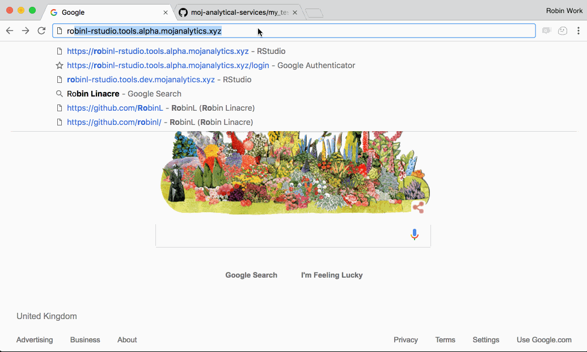
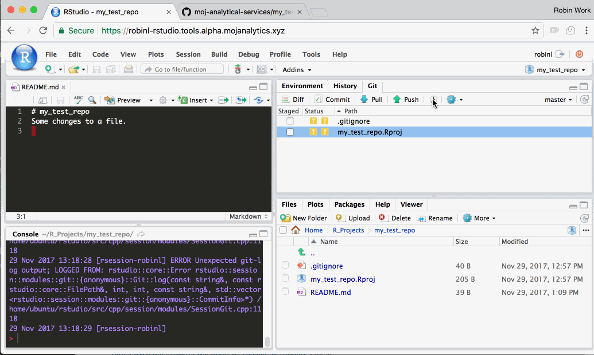

# Using Github with R Studio

Github enables you to collaborate with colleagues on code and share you work with them.  It puts your code in a centralised, searchable place. It also enables you to version control your work.  

This guide provides a step-by-step run through of how to create a project and sync your work with Github.  You can find more in-dept Git training resources [here](https://moj-analytical-services.github.io/platform_user_guidance/getting-started.html#training-resources)

## Simple syncing of your projects

### Step 1 - Create a new project ('repo') in the moj-analytical-services Github page

This is conceptually similar to setting up a folder on the shared drive to save your work in.  

First, navigate to www.github.com and make sure you're logged in.

Then he following gif shows you what you need to do:

  
  
### Step 2:  Navigate to your platform R Studio and check out the project

Follow the steps in this gif:

  
  
Notes:

* When you copy the link to the repo from Github, ensure you use the ssh link, which start `git@github.com` as opposed to the https one, which start `https://github.com/`
  
### Step 3: Edit your files, 'stage' the changes, and then commit them.  

Each commit creates an 'undo point' on in your personal files on the Platform.  You can can always revert back to this point.  

Each commit would typically include changes to a number of different files, rather than the single file shown in the gif.

Note that 'commiting' does not sync your changes with github.com.

Follow the steps in this gif:

 
 
 ### Step 3: 'Push' (sync) your work with github.com
 
 Follow the steps in thie gif:
 
 
 

## Working on a branch.

One of the most useful aspects of git is 'branching'.  This enables the following benefits:

* Allows you to separate out work in progress from completed work.  This means there is always a single 'latest' working version of the code.

* Allows you and collaborators to work on the same project and files concurrently, resolving conflicts if you edit the same parts of the same files.

* Through Github, enables you to coordinate work on several new features or bugs at once, keeping track of how the code has changed and why, and whether it's been quality assured.

* Creates intutitive, tagged 'undo points' which allow you to revert back to previous version of the project e.g. we may wish to revert to the exact code that was tagged 'model run 2015Q1'.

Up until now, we've been working on a single branch called 'master'.

### Step 1 (optional):  Create an Issue in github that describes the piece of work you're about to do (the purpose of the branch)

### Step 2:  Create a new branch in R Studio and tell Github about its existence

### Step 3:  Make some changes to address the Github issue, and push (sync) them with Github

### Step 4: View changes on Github and create pull request

### Step 5:  Sync the changes you made on github.com with your local platform

## Other tips and tricks:

### View how files have changed on the platform and on 

 
 
 
 
